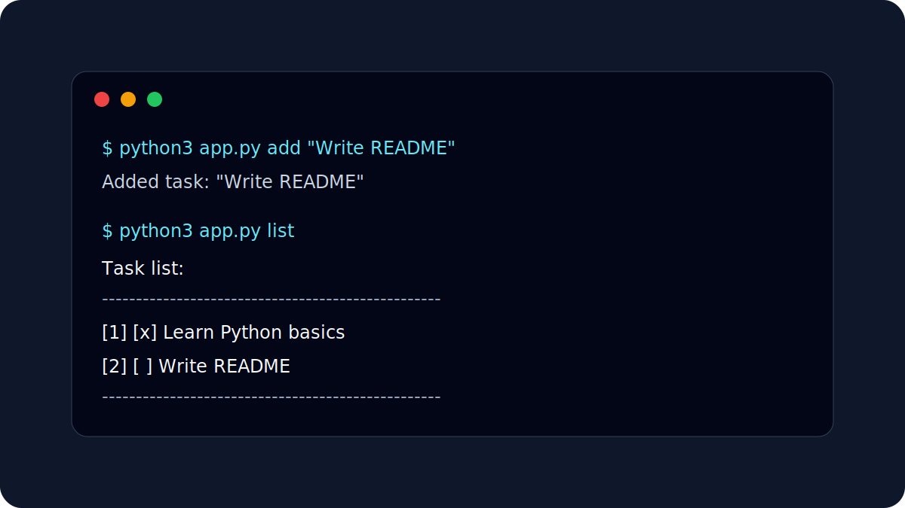

# Task Tracker CLI



A small task tracker that runs in the terminal and stores tasks in a local SQLite database.

Nothing fancy. I built it as a first Python + SQLite exercise to understand how a simple command-line program can keep data after the script closes.

## What it does

- adds tasks
- lists saved tasks
- marks tasks as done
- deletes tasks
- stores everything in `tasks.db`

## Tech stack

- Python
- SQLite

No external packages are needed.

## Usage

Show the help message:

```bash
python3 app.py help
```

Add a task:

```bash
python3 app.py add "Write README"
```

List tasks:

```bash
python3 app.py list
```

Mark a task as done:

```bash
python3 app.py done 1
```

Delete a task:

```bash
python3 app.py delete 1
```

## Example

```text
Task list:
--------------------------------------------------
  [1] [x]  Learn Python basics  (2026-05-17 00:39)
  [2] [ ]  Write README  (2026-05-17 00:40)
--------------------------------------------------
```

## What I learned

- how to read command-line arguments with `sys.argv`
- how to create a SQLite database from Python
- how to create a table if it does not exist yet
- how basic CRUD operations work: create, read, update, delete
- why `.gitignore` matters for local database files
- why small terminal tools are useful for understanding program flow without hiding logic behind a UI

## Possible next steps

- add due dates
- add task priorities
- add categories
- add a search command
- add simple tests

Built while practicing programming fundamentals and preparing small projects for my IT Ausbildung applications.
